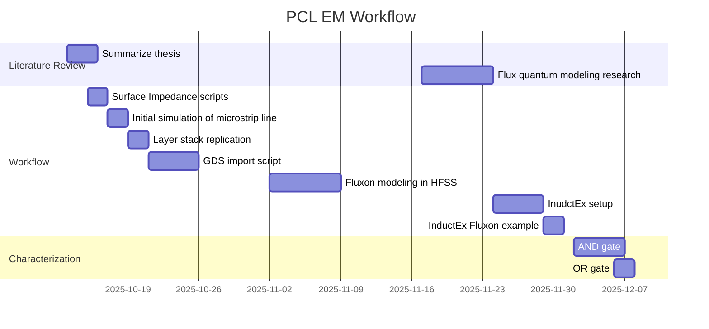

```mermaid
gantt
    title PCL EM Workflow
    dateFormat YYYY-MM-DD
    section Literature Review
        Summarize thesis: 2025-10-13, 3d
        Flux quantum modeling research: 2025-11-17, 7d
    section Workflow
        Surface Impedance scripts :2025-10-15, 2d
        Initial simulation of microstrip line :2025-10-17, 2d
        Layer stack replication: 2025-10-19, 2d
        GDS import script: 2025-10-21, 5d
        Fluxon modeling in HFSS: 2025-11-02, 7d
        InudctEx setup: 2025-11-24, 5d
        InductEx Fluxon example: 2025-11-29, 2d
    Section Characterization
        AND gate :2025-12-02, 5d
        OR gate :2025-12-06, 2d
```
